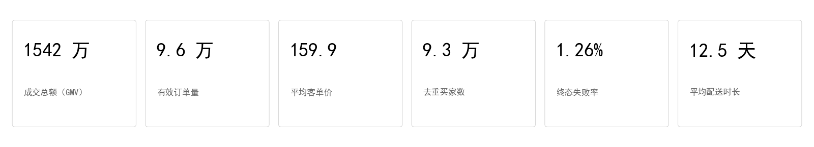
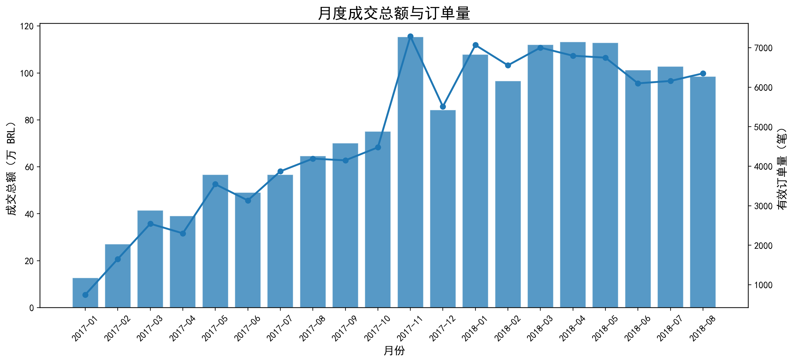
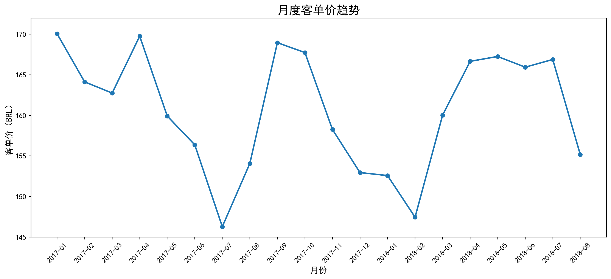
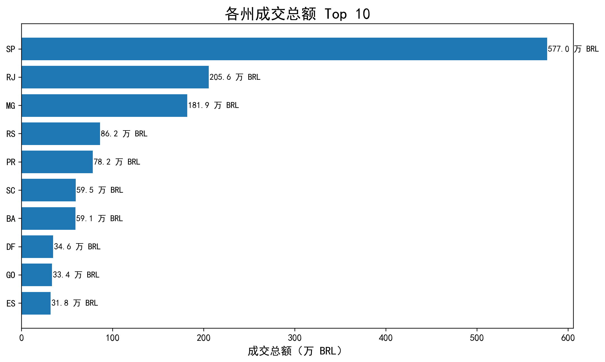
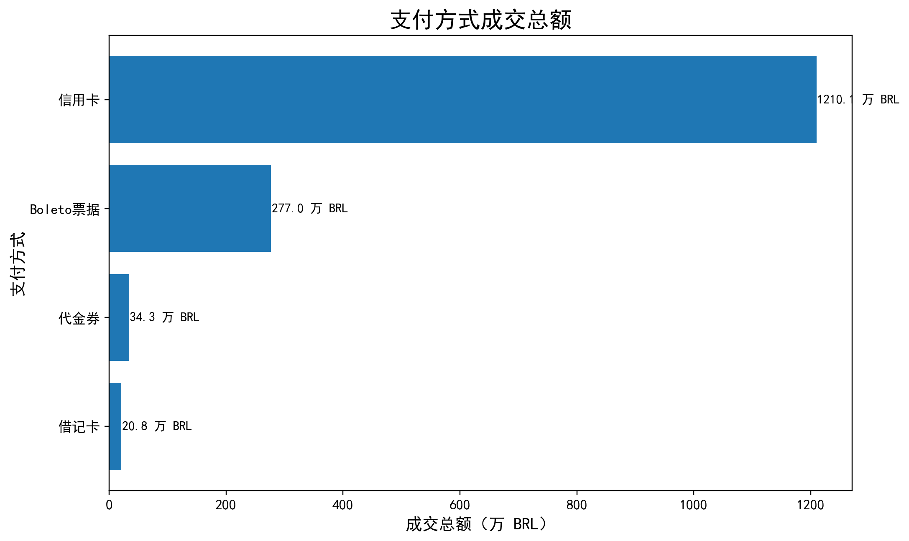
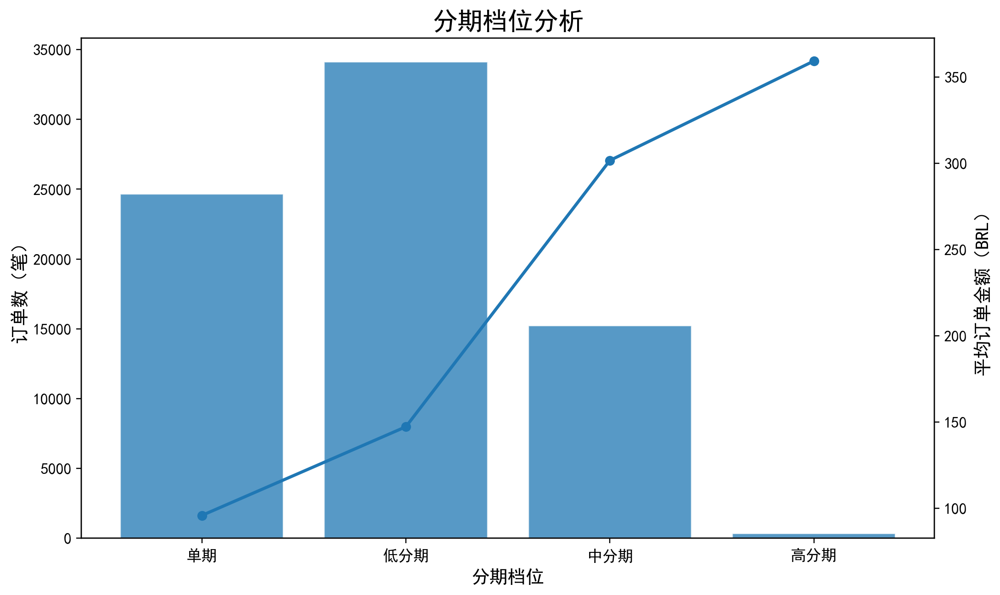

# Olist 电商经营分析：从经营看板到取消风险识别

基于 Olist 巴西电商公开数据集，围绕**平台经营表现**与**订单失败风险**展开分析。  
项目使用 **SQL** 完成多表关联、指标口径统一与专题分析，使用 **Power BI** 进行可视化展示，并进一步将失败订单拆分为 **用户侧取消（canceled）** 与 **平台侧失败（unavailable）** 两条主线。

---

## 项目亮点

- 基于订单表、支付表、客户表完成多表关联与统一口径设计
- 不只做经营看板，还进一步下钻到**取消风险识别**
- 将失败订单拆分为 **用户决策风险** 与 **平台供给风险**
- 从描述性分析延伸到**高风险组合、取消阶段与干预窗口**

---

## 核心结论

### 经营大盘

- **平台在 2017 年进入爆发期，2018 年趋于高位稳定**  
  2017-11 单月成交额达样本期峰值约 **115 万**，2018-03 至 2018-05 连续三个月维持在 **112 万左右**。

- **SP、RJ、MG 三州贡献约 62.5% GMV**  
  核心州高贡献主要依赖订单规模，SP 客单价仅 **142**，低于整体均值 **160**，呈现“靠量不靠价”的特征。

- **信用卡贡献约 78.3% 成交总额**  
  同时分期数越高，平均订单金额越高：单期约 **95**，高分期约 **359**，说明高金额订单更依赖中高分期完成支付。

- **全平台整体提前送达，但偏远州承诺时长明显虚高**  
  平台无系统性超时问题，但 AC、AP 等州承诺时长可达 **40+ 天**，实际约 **20 天** 可送达。

### 取消风险

- **取消订单客单价比完成订单高 16%**  
  取消均价 **157.71**，完成均价 **136.39**，说明取消并不主要来自低价冲动购买，**高客单价订单反而更容易被取消**。

- **高客单价 + Voucher 是最危险的订单组合**  
  Voucher 取消均价 **223.17**，是完成订单均价的 **3.6 倍**；在 **300+ 区间**，Voucher 取消率高达 **11.76%**，而同价位信用卡仅 **0.79%**。

- **取消主要发生在支付后早期，而不是物流末端**  
  **66%** 的取消发生在下单后 **1 小时内**，**88%** 的取消发生在**发货前**，其中 **65.44%** 集中在“审核后、发货前”阶段。

- **复购用户取消率更高，但主要由 Voucher 拉动**  
  首购用户取消率 **0.59%**，复购用户 **1.82%**；其中复购用户 Voucher 取消率高达 **11.90%**。

- **分期不是取消风险来源**  
  单期取消率 **0.56%**，高分期取消率 **0.58%**，基本持平。

### 平台侧失败

- **unavailable 与 canceled 规模几乎相当**  
  `canceled` **625 单（50.65%）**，`unavailable` **609 单（49.35%）**。

- **平台侧失败单笔损失更高**  
  `unavailable` 平均订单金额 **194.88**，高于 `canceled` 的 **157.71**，且主要集中在 **SP、MG、RJ** 等核心交易州。

---

## 经营指标总览

| 指标 | 数值 |
|------|------|
| 成交总额（GMV） | 1,542 万 |
| 有效订单量 | 96,477 |
| 平均客单价（AOV） | 159.86 |
| 去重买家数 | 93,358 |
| 终态失败率 | 1.26% |
| 平均配送天数 | 12.5 天 |

---

## 业务建议

- **优先干预高客单价 + Voucher 订单**  
  Voucher 取消均价 273 元，高于信用卡的 219 元；在 300+ 高价区间，
  Voucher 取消率达 11.76%，是同价位信用卡（0.79%）的约 15 倍。
  若通过支付后确认提醒等手段将 Voucher 整体取消率从 2.43% 降至信用卡水平（0.58%），
  预计可减少 72 单取消，挽回约 19,658 元 GMV。
  该组合特征明确、干预窗口清晰（66% 取消发生在首小时），适合作为优先治理对象。

- **将取消治理重点放在支付后早期**  
  取消集中在首小时和发货前阶段，真正的干预窗口在**支付完成后至发货前**。

- **将失败订单拆成两条线分别管理**  
  `canceled` 属于用户决策风险，`unavailable` 属于平台供给 / 库存风险，不应混合分析。

- **对核心州建立异常监控**  
  SP、RJ、MG 既是成交核心区域，也是失败订单与异常订单的主要分布区域。

---

## SQL 文件结构

| 文件 | 作用 |
|------|------|
| `01_data_audit.sql` | 数据审计：时间窗口、状态分布、州维度摸底 |
| `02_business_overview.sql` | 经营主线：核心 KPI、月度趋势、区域与履约分析 |
| `03_payment_analysis.sql` | 支付专题：支付方式结构、分期结构 |
| `04_cancel_risk_analysis.sql` | 风险专题：取消特征、支付组合、取消阶段、平台侧失败 |
| `11-15_*.sql` | Power BI 看板提数文件 |

---

## 看板预览

### 总览 KPI

### 月度成交额与订单量

### 月度客单价趋势

### 各州成交总额 Top 10

### 支付方式成交总额

### 分期档位分析

---

## 技术栈

**SQL（MySQL） · Power BI · Python（Pandas / Matplotlib） · Markdown**

---

## 数据来源

**Brazilian E-Commerce Public Dataset by Olist（Kaggle）**

核心使用表：

- `olist_orders_dataset`
- `olist_customers_dataset`
- `olist_order_payments_dataset`

---

## 项目能力体现

- **业务问题拆解**：从经营大盘进一步下钻到取消风险与平台失败
- **SQL 提数与建模**：多表关联、订单粒度聚合、统一口径
- **指标设计**：区分用户侧取消与平台侧失败，避免混淆
- **风险识别**：识别高风险支付组合、取消阶段与关键干预窗口
- **可视化表达**：将分析结果整理为 Power BI 看板与结构化项目文档
